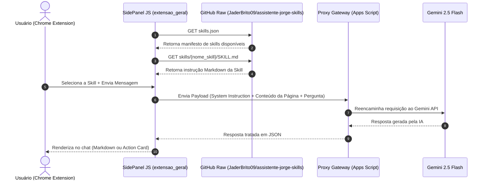

# 🔗 Arquitetura de Integração entre Skills e a Extensão

Este documento descreve como o sub-projeto **`skill_extensao`** (repositório remoto `JaderBrito09/assistente-jorge-skills`) se integra e interage com a extensão do Chrome **`extensao_geral`** (repositório `JaderBrito09/extensao_geral`).

---

## 🏛️ Visão Geral da Arquitetura

O ecossistema do **Assistente do Jorge** adota a separação entre o motor cliente (extensão) e o catálogo de inteligências/especialidades (skills):

1. **`extensao_geral`**: Responsável pela interface do usuário (SidePanel MV3), autenticação OAuth 2.0, captura de DOM/contexto das abas ativas e comunicação segura via Proxy Gateway (Google Apps Script / Gemini 2.5 Flash).
2. **`skill_extensao`**: Repositório central de habilidades onde especialistas publicam e versionam prompts de sistema, rotinas automatizadas, modelos de ação e documentos de referência.

---

## 📡 Fluxo de Comunicação e Injeção Dinâmica

---

## ⚙️ Componentes de Integração

### 1. Manifesto Catálogo (`skills.json`)
Localizado na raiz de `skill_extensao`, o manifesto registra todas as skills e seus caminhos. A extensão lê esse manifesto para popular o menu de seleção (`<select>`).

- **Endpoint Raw GitHub**: `https://raw.githubusercontent.com/JaderBrito09/assistente-jorge-skills/main/skills.json`

### 2. Formato de Instrução (`SKILL.md`)
A extensão analisa (*parser*) o arquivo `SKILL.md` dividindo-o em três partes principais:
- **Título / Nome**: Extraído da linha `# Skill: <Nome>`
- **Orientação ao Usuário**: Seção `## Orientação Inicial ao Usuário`, exibida no chat imediatamente após o usuário selecionar a skill.
- **System Prompt**: Seção `## System Prompt`, enviada como `systemInstruction` em segundo plano para o Gemini 2.5 Flash.

### 3. Janelas Interativas / Action Cards (`interactive_prompt`)
As Skills podem instruir o modelo no `System Prompt` a retornar respostas em formato de bloco de código JSON do tipo `"interactive_prompt"`. A extensão intercepta esse JSON e renderiza botões clicáveis dinâmicos no SidePanel.

---

## 🔒 Permissões e Segurança na Integração

- **GitHub Raw Endpoint**: A extensão possui permissão em seu `manifest.json` (`host_permissions`) para consultar `https://raw.githubusercontent.com/JaderBrito09/assistente-jorge-skills/main/*`.
- **Controle de Acesso por Usuário**: O Proxy Gateway no Apps Script pode filtrar quais `skills` cada usuário/e-mail tem permissão de visualizar e utilizar com base na planilha de controle.
